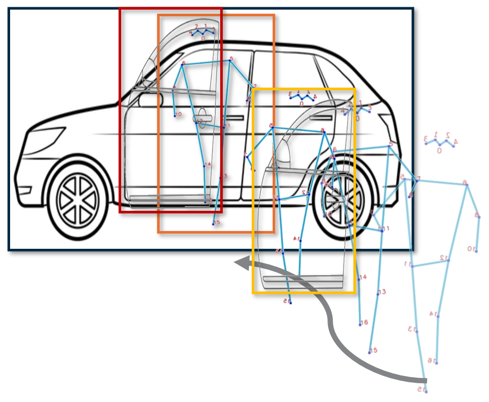

# 👋 유승진
💻 Software Developer | 🌟 Passionate about Open Source  
안녕하세요!. java개발자에서 AI엔지니어로 전향한 개발자 입니다.  다양한 MODEL을 기반으로 실질적인 서비스를 제공할 수 있는지 고민하며, 
AI 기술을 활용한 문제 해결과 비즈니스 가치를 창출하는 데 열정을 가지고 있습니다.

## 🚀 Projects

### 1. [영상기반 주취행동분석 및 주취운전 감지](https://github.com/rajpresso/IntoxiTrackSense)
🔹 **Description**: 컴퓨터 비전과 딥러닝 기술을 활용하여 영상(CCTV)에서 주취행동(술에 취한 행동)과 차량을 탐지하여 주취자가 차량을 탑승하는 행위를 감지하는 모델을 개발.  
🔹 **Tech Stack**: ubunto, python, pytotch, mysql, fastAPI,anaconda, vscode  

---
<table>
  <tr>
    <td>
      
    </td>
    <td>
        <b>🔹 Features:</b>
      <ul>
        <li>주취자 행동 분석 및 Tracking 모델</li>
        <li>차량 Tracking, 운전석문 열림</li>
      </ul>
    </td>
  </tr>
</table>

---

### 2. [구음장애 음성인식](https://github.com/rajpresso/Voice_recognition)
🔹 **Description**: 발음이나 발성에 어려움이 있는 사용자의 말을 인식하고 이해할 수 있도록 설계된 특화된 모델로  STT 서비스를 목적으로 하였다.  

*향후 경량화를 하여 앱과 웹서비스를 구축하여 서비를 제공하고자 한다 

🔹 **Model** : Whisper, wav2vec2

🔹 **Tech Stack**: python, pytotch,

---

### 3. [무단횡단자 감지](https://github.com/rajpresso/Jaywalk-detection)
🔹 **Description**: 세종테크노파크에서는 세종 자율주행 시범운행지구 운영을 통해 자율주행 차량 데이터와 관제 데이터를 활용 횡단, 무단횡단 보행자를 감지하는 AI 경진대회
아쉽게 수상을 하지 못하였다. 

🔹 **Tech Stack**: python, pytotch
